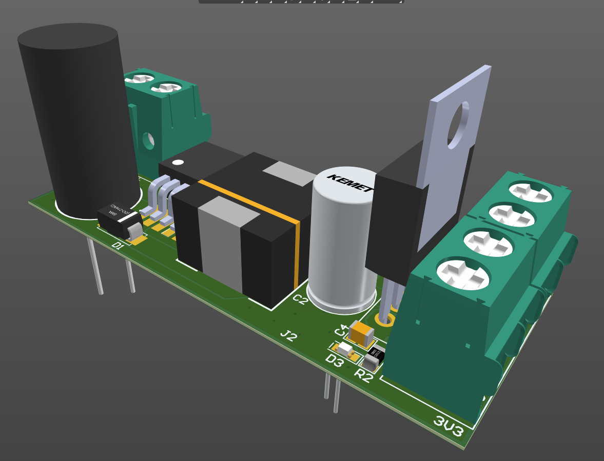

 
 

<!-- BAŞLIK -->
<h1> 
  

     PCB Design Collection
  

</h1>

 
 
 

<!-- AÇILIŞ -->
<h2> 
   
     
     
  

     <a href="https://github.com/enesmrcn/PCB-Design/tree/main/SatWare"> SatWare (Satellite Control Hardware) </a>
     
     
     
  

 
 
  
  

</h2>

<!-- KAPANIŞ -->

<!-- AÇILIŞ -->
<h2> 
   
   
   
  

     <a href="https://github.com/enesmrcn/PCB-Design/tree/main/Security%20Board"> Security Board </a>
     
     
     
  

 
  
  

</h2>

<!-- KAPANIŞ -->

<!-- AÇILIŞ -->
<h2> 
   
   
   
  

  <a href="https://github.com/enesmrcn/PCB-Design/tree/main/iMX6%20Main%20Board"> iMX6 Main Board </a>
     
     
     
  

 
 
  
  

</h2>

<!-- KAPANIŞ -->

<!-- AÇILIŞ -->
<h2> 
   
   
   
  

      <a href="https://github.com/enesmrcn/PCB-Design/tree/main/L86M33%20Breakout%20Board"> L86M33 Breakout Board </a>
     
     
     
  
  
  
 
 
  
  

</h2>

<!-- KAPANIŞ -->

<!-- AÇILIŞ -->
<h2> 
   
   
   
  

     <a href="https://github.com/enesmrcn/PCB-Design/tree/main/Neo-7M%20GNSS%20Evaluation%20Board"> Neo-7M GNSS Evaluation Board </a>
     
     
     
  

 
  
  

</h2>

<!-- KAPANIŞ -->

<!-- AÇILIŞ -->
<h2> 
   
   
   
  

  <a href="https://github.com/enesmrcn/PCB-Design/tree/main/PSU"> LM2596 Buck Converter </a>
     
     
     
  

 
  
  

</h2>

<!-- KAPANIŞ -->

<!-- AÇILIŞ -->
<h2> 
   
   
   
  

     <a href="https://github.com/enesmrcn/PCB-Design/tree/main/LD1117-3V3%20Regulator"> LD1117 Linear Regulator </a>
     
     
     
  

 
  
  

</h2>

<!-- KAPANIŞ -->

<!-- AÇILIŞ -->
<h2> 
   
   
   
  

  <a href="https://github.com/enesmrcn/PCB-Design/tree/main/PSU"> Micro SD Breakout Board </a>
     
     
     
  

 
  
  

</h2>

<!-- KAPANIŞ -->

<!-- AÇILIŞ -->
<h2> 
   
   
   
  

  <a href="https://github.com/enesmrcn/PCB-Design/tree/main/PSU"> LP3852 Linear Regulator </a>
     
     
     
  

 
  
  

</h2>

<!-- KAPANIŞ -->

<!-- AÇILIŞ -->
<h2> 
   
   
   
  

  <a href="https://github.com/enesmrcn/PCB-Design/tree/main/PSU"> LM2596 Breakout Module </a>
     
     
     
  

 
  
  

</h2>

<!-- KAPANIŞ -->

<!-- SHIELDS -->

  <!-- Visitors badge: -->
  
